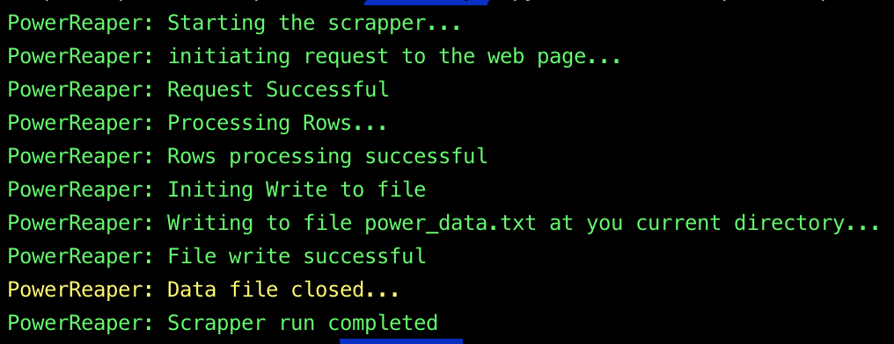

# power-reaper

A web scrapper to collect power-cut data for the city of Bengaluru from the public data provided by BESCOM

This is a python3 package to scrape publicly available data regarding unplanned power cuts in the city od Bengaluru.

<p align="center">
    
</p>

### Intention:

This package will be a part of a larger system that might make getting the information about powercuts in their areas easier
for the people of the city.

### Features of the standalone package:

- Fetches publicly available data from source website
- Does a basic data cleaning
- Formats the data in a manner easier for a computer program to utlize the data later on.
- Save the cleansed and formatted data as a text file in the current working directory.

### Build from Source:

This package is built using [Python Poetry](https://python-poetry.org/) , for which an extensive documentation can be
found [here](https://python-poetry.org/docs/)

- Install pyhon poetry in your system.
- clone this repo.
- Build the source:
  `poetry build`
- A tar ball and a wheel file will be available in a directory named dist, which would be created after the build succeeds.

### Installation of the package:

After building the project from source as described above, do the following:

- `cd` into the dist directory
- run the following pip install command:
  `pip3 install powerReaper-0.1.0.tar.gz`
  <br/>
  <em>Note: Change the version number as per your current build file.</em>

### usage:

```
    python3 -c "from powerreaper import reap; reap.main()"
```

The above command will create a text file named `power_data.txt` in you current working directory.
